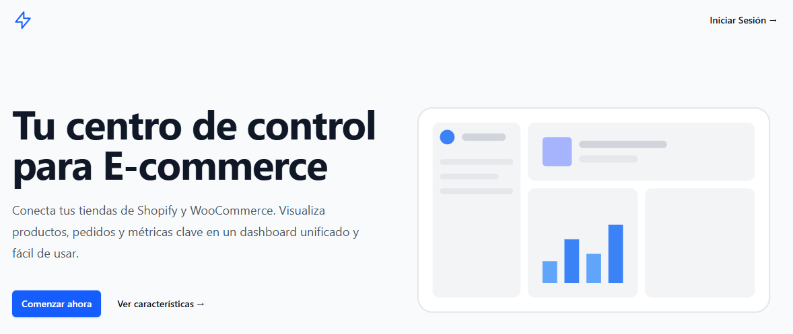

# Dashboard de Integración E-Commerce



## 📄 Descripción del Proyecto

Este proyecto es una solución completa al desafío técnico propuesto por Amplifica. Se ha desarrollado una aplicación web "monolítica moderna" utilizando **Laravel** con **Inertia.js** y **Vue.js**, que permite a los usuarios conectar sus tiendas de e-commerce (WooCommerce y Shopify) para visualizar y gestionar productos, pedidos y métricas clave de forma centralizada.

El enfoque arquitectónico con Inertia.js fue elegido deliberadamente para crear una experiencia de usuario fluida y rápida, similar a una SPA, pero eliminando la complejidad de gestionar una API separada, CORS y la autenticación de tokens, lo que resulta en un desarrollo más rápido y un código más cohesivo.


Para una guía detallada sobre cómo utilizar la aplicación, por favor consulta nuestro **[Manual de Usuario](./docs/MANUAL_DE_USUARIO.md)**.

---

## ✨ Funcionalidades Implementadas

### Requisitos Obligatorios
- ✅ **Autenticación de Usuarios:** Sistema completo de registro e inicio de sesión con Laravel Breeze.
- ✅ **Conexión con Tiendas:** Soporte para conectar tiendas de **WooCommerce** (vía API Keys) y **Shopify** (vía OAuth 2.0).
- ✅ **Visualización de Productos:** Listado de productos de la tienda conectada con imagen, nombre, SKU y precio.
- ✅ **Visualización de Pedidos Recientes:** Listado de los pedidos de los últimos 30 días con cliente, fecha, estado y total.
- ✅ **Exportación de Datos:** Funcionalidad para exportar los listados de productos y pedidos a formato **Excel (.xlsx)**.

### Funcionalidades Adicionales (Opcionales)
- ✅ **Frontend Moderno con Vue.js:** Interfaz de usuario reactiva y dinámica construida con Vue 3 y Vite.
- ✅ **Soporte Multi-Plataforma:** La arquitectura de servicios (Interfaz + Fábrica) permite añadir nuevas plataformas de e-commerce con un mínimo esfuerzo.
- ✅ **Métricas Agregadas:** El Dashboard principal muestra tarjetas con estadísticas clave (Ventas totales, N° de pedidos, Valor promedio) de los últimos 30 días.
- ✅ **Filtros Avanzados:** La tabla de pedidos permite filtrar los resultados por estado y buscar por cliente.
- ✅ **Pruebas Automatizadas:** Se ha implementado una suite de pruebas de funcionalidad y unitarias con PHPUnit para garantizar la calidad y estabilidad del código.
- ✅ **Experiencia de Usuario Mejorada:** Se incluyen notificaciones "flash" para confirmar acciones, una página de bienvenida profesional y paginación en las tablas de datos.

---

## 🚀 Stack Tecnológico

- **Backend:** PHP 8.1+, Laravel 11
- **Frontend:** Vue.js 3 (Composition API), Inertia.js, Vite
- **Estilos:** Tailwind CSS
- **Base de Datos:** MySQL / PostgreSQL (configurable)
- **Testing:** PHPUnit
- **Otros:** Maatwebsite/Laravel-Excel, Ziggy

---

## ⚙️ Guía de Instalación y Levantamiento

Sigue estos pasos para configurar el proyecto en tu entorno de desarrollo local.

### Requisitos Previos
- PHP >= 8.1
- Composer
- Node.js >= 18.0 y NPM
- Una base de datos (ej. MySQL)

### 1. Clonar el Repositorio
```bash
git clone [URL_DE_TU_REPOSITORIO]
cd [NOMBRE_DEL_PROYECTO]
```

### 2. Configuración del Backend (Laravel)
```bash
# Instalar dependencias de PHP
composer install

# Copiar el archivo de variables de entorno
cp .env.example .env

# Generar la clave de la aplicación
php artisan key:generate

# Configurar las variables de entorno en el archivo .env (ver sección abajo)
# Especialmente las de la base de datos (DB_DATABASE, DB_USERNAME, DB_PASSWORD)
# y las de Shopify (SHOPIFY_API_KEY, SHOPIFY_API_SECRET).

# Ejecutar las migraciones para crear las tablas en la base de datos
php artisan migrate
```

### 3. Configuración del Frontend (Vue.js)
```bash
# Instalar dependencias de JavaScript
npm install

# Compilar los assets para desarrollo
npm run dev
```

### 4. Ejecución
Una vez completados los pasos anteriores, la aplicación estará corriendo.
- El backend estará disponible en la URL que configures (por defecto, `php artisan serve` la levanta en `http://localhost:8000`).
- Accede a la aplicación a través de esa URL en tu navegador.

---

## 🔑 Variables de Entorno (`.env`)

A continuación se detallan las variables de entorno más importantes que debes configurar en tu archivo `.env`:

```dotenv
APP_NAME="Amplifica Dashboard"
APP_URL=http://localhost:8000

DB_CONNECTION=mysql
DB_HOST=127.0.0.1
DB_PORT=3306
DB_DATABASE=nombre_de_tu_bd
DB_USERNAME=tu_usuario_bd
DB_PASSWORD=tu_contraseña_bd

# Credenciales de tu App de Shopify (obtenidas desde Shopify Partners)
SHOPIFY_API_KEY=tu_identificacion_de_cliente_shopify
SHOPIFY_API_SECRET=tu_informacion_secreta_de_cliente_shopify
```

---

## 🧪 Cómo Probar la Integración

Para probar la funcionalidad completa, necesitarás credenciales de una tienda de WooCommerce y una de Shopify.

### WooCommerce
1.  En el panel de tu tienda WordPress, ve a **WooCommerce > Ajustes > Avanzado > API REST**.
2.  Crea una nueva clave de API.
3.  Asegúrate de asignarla a un usuario **Administrador** y darle permisos de **"Lectura/Escritura"**.
4.  Usa la "Clave de cliente" y la "Clave secreta del cliente" en el formulario de conexión de la aplicación.

### Shopify
1.  Crea una cuenta en **Shopify Partners** ([partners.shopify.com](https://partners.shopify.com)).
2.  Crea una **tienda de desarrollo** para pruebas.
3.  En el panel de Partners, ve a **Apps > Crear app** y crea una nueva aplicación manualmente.
4.  En la **Configuración de la aplicación**, establece las siguientes URLs:
    - **URL de la aplicación:** `http://localhost:8000`
    - **URI de redireccionamiento permitidas:** `http://localhost:8000/shopify/callback`
5.  Obtén la **"Identificación de cliente"** y la **"Información secreta de cliente"** y ponlas en tu archivo `.env`.
6.  Usa la URL de tu tienda de desarrollo (ej: `nombre-tienda.myshopify.com`) en el formulario de conexión de la aplicación para iniciar el flujo de autorización OAuth.

---

## ✅ Ejecución de Pruebas Automatizadas

El proyecto incluye una suite de pruebas para garantizar la calidad del código. Para ejecutarlas, corre el siguiente comando en la terminal:

```bash
php artisan test
