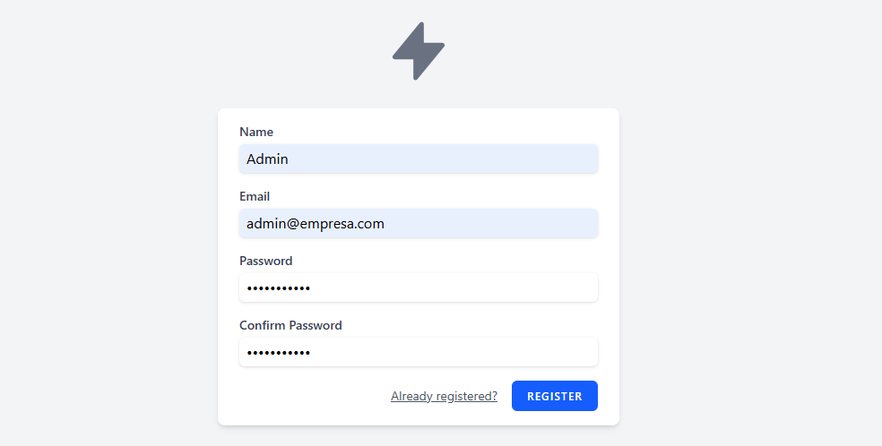
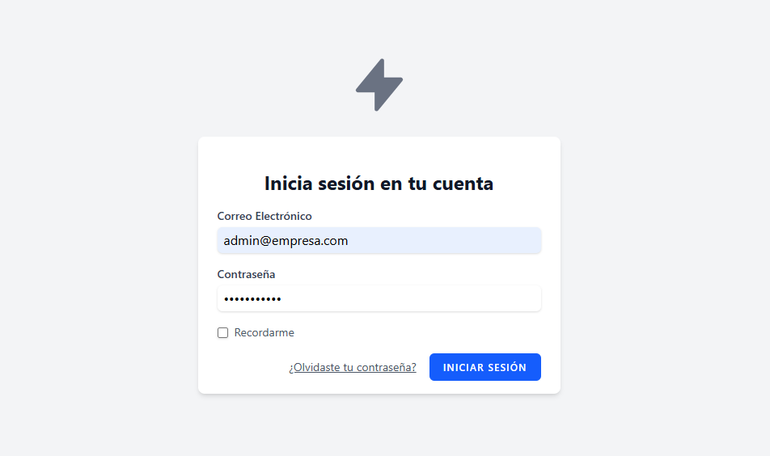
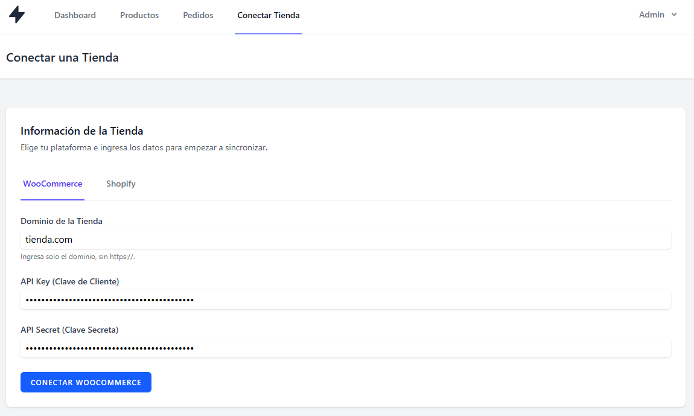
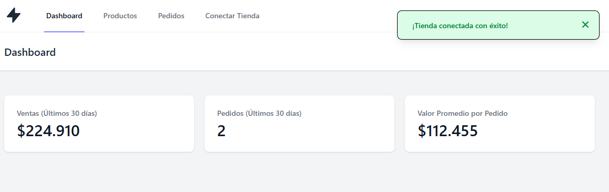
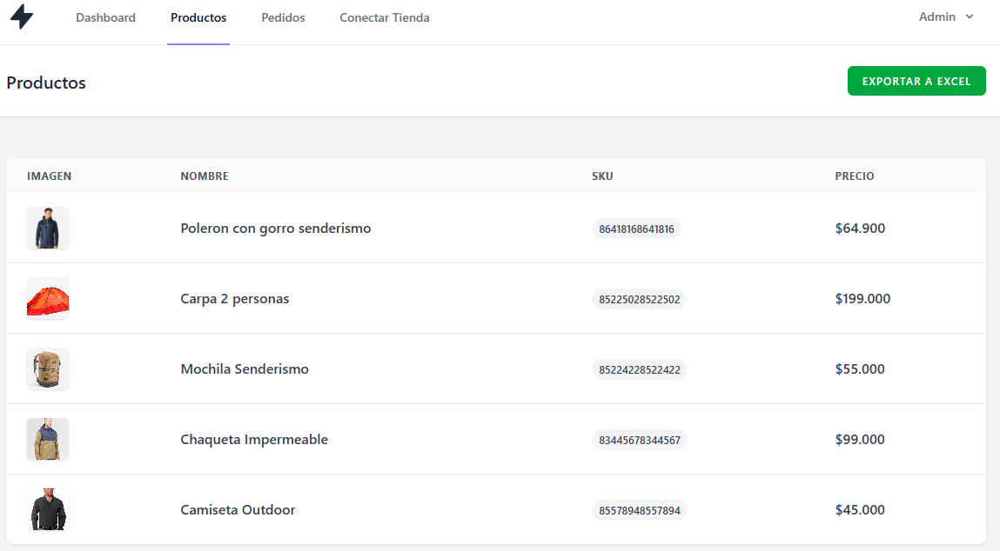
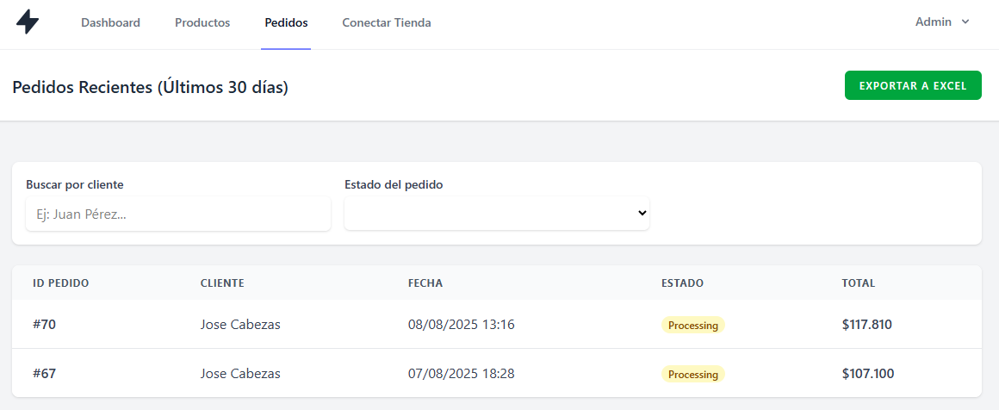

# Manual de Usuario: Dashboard de Integración E-Commerce

## 1. Introducción

¡Bienvenido al Dashboard de Integración E-Commerce! Esta herramienta ha sido diseñada para ayudarte a centralizar la información de tus tiendas online de WooCommerce y Shopify en un único lugar.

Con este dashboard, podrás visualizar rápidamente tus productos, monitorear tus pedidos recientes, analizar métricas de ventas clave y exportar tus datos para un análisis más profundo. Este manual te guiará a través de todas las funcionalidades de la aplicación.

## 2. Primeros Pasos: Registro e Inicio de Sesión
Para comenzar a utilizar la aplicación, primero necesitas crear una cuenta.

### Registro de una Nueva Cuenta

1. En la página de bienvenida, haz clic en el botón **"Registrarse"**.

2. Completa el formulario con tu nombre, una dirección de correo electrónico válida y una contraseña segura.

3. Haz clic en **"Registrarse"**. Serás redirigido automáticamente a tu nuevo dashboard.

### Inicio de Sesión

1. En la página de bienvenida, haz clic en **"Iniciar Sesión"**.

2. Ingresa tu correo electrónico y la contraseña que creaste durante el registro.

3. Puedes marcar la casilla "Recordarme" para mantener tu sesión iniciada.

4. Haz clic en **"Iniciar Sesión"**.

## 3. Conectar tu Tienda

El primer paso después de iniciar sesión es conectar tu tienda de e-commerce. La aplicación es compatible con WooCommerce y Shopify.

1. En el menú de navegación principal, haz clic en **"Conectar Tienda"**.

2. Verás una página con dos pestañas: WooCommerce y Shopify. Selecciona la plataforma que deseas conectar.

### Conectar una Tienda WooCommerce

1. Asegúrate de que la pestaña WooCommerce esté seleccionada.

2. Dominio de la Tienda: Ingresa el dominio de tu tienda sin https:// (ej: mitienda.com).

3. API Key (Clave de Cliente): Pega la Clave de Cliente que generaste en el panel de WooCommerce.

4. API Secret (Clave Secreta): Pega la Clave Secreta del Cliente.

4. Haz clic en "Conectar WooCommerce". Si los datos son correctos, serás redirigido al Dashboard y verás una notificación de éxito.

### Conectar una Tienda Shopify

1. Selecciona la pestaña Shopify.

2. Dominio de tu tienda Shopify: Ingresa el dominio .myshopify.com de tu tienda (ej: nombre-tienda.myshopify.com).

3. Haz clic en "Conectar con Shopify".

4. Serás redirigido a una página de autorización de Shopify. Si no has iniciado sesión en tu tienda, te pedirá que lo hagas.

5. Shopify te pedirá que confirmes los permisos que la aplicación necesita. Haz clic en "Instalar app".

6. Serás redirigido de vuelta a tu Dashboard en nuestra aplicación, y verás una notificación de éxito.

## 4. Navegación por el Dashboard
Una vez que hayas conectado tu tienda, podrás empezar a explorar sus datos.

### Dashboard Principal

Esta es la primera pantalla que ves después de iniciar sesión. Aquí encontrarás tarjetas con métricas clave sobre el rendimiento de tu tienda en los últimos 30 días:

- **Ventas Totales:** La suma de los ingresos de los pedidos completados.

- **Número de Pedidos:** La cantidad total de pedidos recibidos.

- **Valor Promedio por Pedido:** El ingreso promedio que genera cada pedido.

### Menú de Navegación

En la parte superior de la pantalla, encontrarás los enlaces principales:

- **Dashboard:** Te lleva a la página principal de métricas.

- **Productos:** Muestra un listado de los productos de tu tienda.

- **Pedidos:** Muestra un listado de los pedidos recientes.

- **Conectar Tienda:** Te permite conectar o actualizar los datos de tu tienda.

En la esquina superior derecha, al hacer clic en tu nombre, podrás ver la URL de la tienda que tienes conectada, acceder a tu Perfil o Cerrar Sesión.

## 5. Gestión de Productos

1. Haz clic en "Productos" en el menú de navegación.

2. Verás una tabla con todos los productos activos de tu tienda, incluyendo su imagen, nombre, SKU y precio.

3. Si tienes muchos productos, la tabla estará paginada. Puedes usar los controles en la parte inferior para navegar entre las páginas.

### Exportar Productos

Para descargar un listado completo de tus productos, haz clic en el botón **"Exportar a Excel"** ubicado en la esquina superior derecha de la página. Se generará y descargará un archivo .xlsx con todos los datos.

## 6. Gestión de Pedidos

1. Haz clic en **"Pedidos"** en el menú de navegación.

2. Verás una tabla con los pedidos de los últimos 30 días, mostrando el ID del pedido, el nombre del cliente, la fecha, el estado y el total.

### Filtrar Pedidos

Puedes filtrar la lista de pedidos para encontrar información específica:

- **Buscar por cliente:** Escribe el nombre de un cliente en el campo de búsqueda para ver solo sus pedidos.

- **Estado del pedido:** Usa el menú desplegable para filtrar los pedidos por su estado (ej: Procesando, Completado, etc.).

### Exportar Pedidos

Al igual que con los productos, puedes descargar un listado de los pedidos que estás viendo (respetando los filtros aplicados) haciendo clic en el botón **"Exportar a Excel"**.
